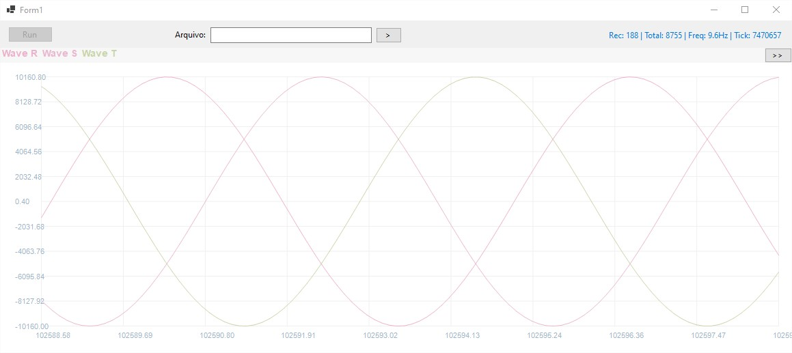

# GenericThreePhaseMotorController

The software is generic and can be used for synchronous or asynchronous motors. One example of an application is BLDC synchronous motors (used in drones). In this case, since precise positioning is not required, the drive can be configured for use without an encoder.

For synchronous mode, it is also possible to use servomotors with encoders (common in robotics). In this application, it is necessary to ensure torque for large movement impulses and precise positioning.

The software will also support use with large asynchronous induction motors, and can be configured with FOC, VF control, or a combination of both. The IGBT activation dead time can be configured. This configuration is necessary to ensure that there is no unwanted short circuit in the activation cycle, caused by a delay in the IGBT deactivation times.

The image below is of a Windows app that I implemented to monitor the generated phases and calculations of the FOC control. It is also to monitor any microcontroller variable. The app captures logs via USB port.

  

After this phase of debugging the controls, I will post my progress in implementing the drive hardware.
